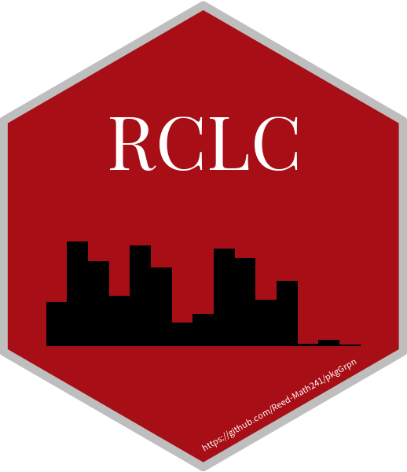

```{r, include = FALSE}
knitr::opts_chunk$set(
  collapse = TRUE,
  comment = "#>",
  fig.path = "man/figures/README-",
  out.width = "100%"
)
```

# RCLC </a>

<!-- badges: start -->
<!-- badges: end -->

The goal of RCLC (Reed College Library Checkout) is to provide an easy-to-use and insightful dataset with clear information about book checkouts from the Hauser Memorial Library from 2018 to 2020. Each observation in this data set corresponds to a checkout!

## Installation

The development version of Reed College Library Checkout is available from
[GitHub](https://github.com/Reed-Math241/pkgGrpn) with:

```r
library(devtools)
install_github("Reed-Math241/pkgGrpn")
```

## Usage
To import our dataset, just run:
```{r}
library(RCLC)
# Sourcing the data directly from the package
checkouts <- reed_checkouts # Also possible to use RCLC::reed_checkouts
```

Alternatively, the built-in `get_checkouts` function is analogous to `reed_checkouts`:

```{r}
library(RCLC)
# Using the package function
checkouts <- get_checkouts() # Default value returns entire dataset, no argument needed
```

The three facilities in which Reedies could checkout resources are the IMC, PARC, and the Hauser Library. To get the checkouts data for the IMC or the PARC, you may use the `get_checkouts` function as such:

```{r, eval=FALSE}
# Get PARC checkout data
PARC_checkouts <- get_checkouts(location = "PARC")
# Get IMC checkout data
IMC_checkouts <- get_checkouts(location = "IMC")
```

The `get_checkouts` function is versatile! You could also query substrings of checkout locations to get various filterings of the checkout data. Consider the following code, where the user obtains musical score checkouts:

```{r, eval=FALSE}
# Get musical score checkout data
score_checkouts <- get_checkouts(location = "Score")
```

## Example
Here is an example of our data in action! This is a heatmap (over a calendar) of checkout data by day in 2019 v. 2020.


```{r, warning=F, message=F}
library(openair)
library(dplyr)

filtered <- reed_checkouts %>%
  filter(as.numeric(strftime(Loaned, "%m")) %in% 2:5) %>%
  group_by(Loaned) %>%
  summarise(checkouts = n()) %>%
  rename(date=Loaned)
```


Can you think of why 2020 looks so different from 2019? 🤔

```{r}
calendarPlot(filtered,
             pollutant = "checkouts", 
             year = 2019,
             main = "Checkouts 2019 (Redux)",
             limits = c(0, max(filtered$checkouts))
)
```

```{r}
calendarPlot(filtered,
             pollutant = "checkouts", 
             year = 2020, 
             main = "Checkouts 2020 (Redux)",
             limits = c(0, max(filtered$checkouts))
)
```
