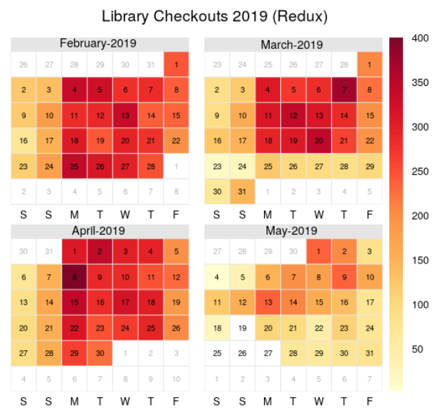
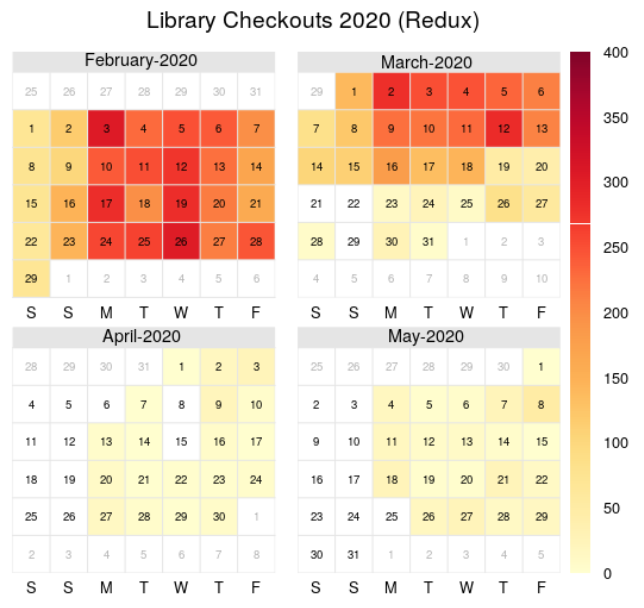

<!-- README.md is generated from README.Rmd. Please edit that file -->

<!-- You'll still need to render `README.Rmd` regularly, to keep `README.md` up-to-date. `devtools::build_readme()` is handy for this.  -->

# RCLC

<!-- badges: start -->

<!-- badges: end -->

The goal of RCLC (Reed College Library Checkout)

## Installation

The development version of Reed Library Checkout is available from
[GitHub](https://github.com/Reed-Math241/pkgGrpn) with:

``` r
# install.packages("devtools")
devtools::install_github("Reed-Math241/pkgGrpn")
```

## Example

``` r
library(RCLC)
```
Here is an example of a picture:



